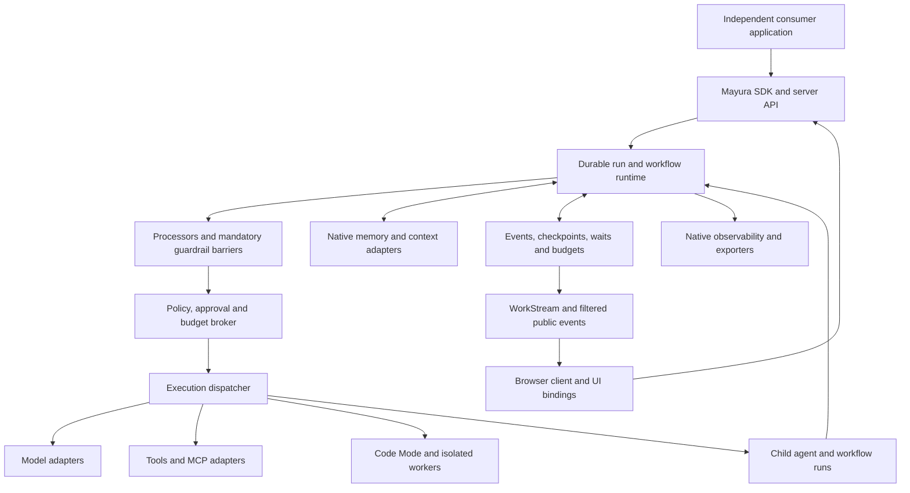

# Mayura — Agentic Development Framework Source of Truth

Version: 1.3  
Created: 2026-09-20  
Updated: 2026-09-20 — implementation authorized; standalone Mayura workspace and evidence ledger established.  
Status: Implementation in progress in `mayura/`; experimental foundation only, not enterprise-qualified.  
Product owner: Project owner.  
Language: Full-stack TypeScript.  
Development model: Standalone framework with its own roadmap, tests, versions, and releases.  
Distribution: Open-source agent development framework for independent developers and organizations.  
Future downstream consumer: Arth, the open-source agent.  
Related downstream plan: Arth maintains its own agent plan; it is not a Mayura specification dependency.

## 1. Purpose and authority

Mayura is our own independently developed TypeScript framework for building agents and agent-powered applications. It provides the execution runtime, workflows, orchestration, tools, memory, context, guardrails, processors, human intervention, server, client interfaces, and observability needed for reliable long-running work. Later, Arth will adopt Mayura through its public interfaces to implement its engineering-agent behavior.

This document is the canonical development plan for Mayura. Architecture decisions, specifications, packages, implementation tasks, tests, and release gates must reference it. The owner subsequently authorized local implementation in `mayura/` with Markdown documentation in `mayura/docs/`, and later selected Apache-2.0 while directing completion of every release gate. Those decisions do not publish packages, deploy a service, or alter the archived GitHub repository. See the [implementation evidence ledger](development-status.md) for actual deliveries and bounded claims.

The user has selected **Mayura as our own full-stack TypeScript framework** and specified that it develops independently of Arth. This document alone defines Mayura's product requirements and release gates; the Arth plan defines the later application's requirements. Neither plan automatically imports the other's acceptance criteria. Explicit user direction and applicable `AGENTS.md` instructions govern each project.

Mayura has its own project/repository boundary, package versions, roadmap, fixtures, documentation, CI, and release decisions. It must build, test, run, and release without Arth source, packages, configuration, credentials, profiles, fixtures, or infrastructure. A separate local Git repository now exists in `mayura/`, without a configured remote. The dependency direction is one-way: future Arth code depends on published Mayura contracts; Mayura never depends on Arth. An Arth compatibility gap becomes an Arth adapter/integration decision or a separately evaluated general-purpose Mayura feature request, not an automatic framework release blocker.

Requirements marked **required** derive from the brief or are necessary for coherent execution. **Planned defaults** make behavior concrete and may change through a recorded decision. **Specification-stage decisions** identify details to settle before the affected implementation. They do not reopen the choice to build Mayura.

Record changes to authority, execution semantics, public schemas, persistence, dependency licensing, and release scope with a date, rationale, affected requirements, and test impact. Untrusted content, recalled memory, tool output, or generated code cannot amend this plan or grant permissions.

## 2. Product boundary and success definition

### 2.1 What Mayura owns

Mayura owns its public programming model, typed execution contracts, durable runtime, workflow semantics, scheduling, policy composition, processor lifecycle, and native memory/context interfaces. It may use mature libraries for databases, validation, protocols, cryptography, tracing, and operating-system integration. We do not need to rebuild those primitives to own the framework.

The required product has three usable surfaces: an embeddable TypeScript SDK, a self-hostable execution server with workers, and browser-safe TypeScript clients with optional UI bindings. Full-stack means an application can define its agent behavior on the server and consume typed results, progress, approvals, and artifacts in a frontend. Browser code never receives server credentials or raw privileged execution capabilities.

Native memory, context, observability, and workflow execution must work as standalone framework capabilities without a consumer application or mandatory platform account/hosted memory-orchestration service. Optional providers can improve or replace selected functions through adapters.

### 2.2 What Arth and Arth.sh own

Arth will own engineering-specific planning, `ARTH.md` management, `AGENTS.md` resolution, its skills catalog, repository edits, Git policies, OpenTofu/provider workflows, test strategies, browser/computer-use tasks, and its user-facing modes. Arth will implement and test those behaviors during its later adoption stage. Mayura supplies independently specified reusable primitives and generic contract tests.

Arth.sh remains a later closed-source platform. Account billing, subscriptions, commercial dashboards, and platform-specific business logic are deferred. Mayura supports authentication, scoped data access, quotas, and audit interfaces because an execution server needs them, without building an unrelated SaaS product.

Mayura's open-source distribution is an explicit product requirement. The owner selected Apache License 2.0 for Mayura, providing permissive redistribution and modification rights with an explicit patent grant; the choice is independent of Arth's license. Distribute the framework's usable source, build instructions and published packages, with no Mayura-hosted account or proprietary runtime required for advertised framework capabilities. Optional external providers retain their own terms and costs. Possible commercial value includes support, managed operations, and integrations; pricing and entitlement systems are outside this plan. Open source includes redistribution and modification rights, not merely visible source. [Open Source Definition](https://opensource.org/osd)

### 2.3 Success

A developer can define a typed tool, compose it into a workflow, call that workflow from an agent, delegate a child agent, pause for a person or event, restart the process, resume safely, stream approved results to a client, inspect evidence, and enforce a shared budget without inventing a second orchestration system.

Validate these contracts with standalone applications and generic fixtures covering Code Mode, parallel work, memory providers, and human-approved host execution. Arth can later consume the same supported contracts. Enterprise readiness is demonstrated by recovery, isolation, compatibility, and evaluation evidence, not by a large feature list alone.

### 2.4 Consumer-first product contract

The primary users are developers building their own agents, not Mayura maintainers or the Arth team. Enterprise-grade reliability and easy adoption are simultaneous requirements. Expose a small, predictable authoring API over the rigorous runtime; do not make every consumer understand scheduling, storage internals or deployment infrastructure before their first agent runs.

The standard first-agent recipe needs instructions, a selected model adapter, and a typed tool definition with a handler and explicit effects/capabilities. Supply safe bounded defaults for execution limits, plus credential-free deterministic fixtures. Real model use clearly discloses provider setup and costs. Defaults and helpers never conceal permission grants or claim durability where none exists.

Support progressive adoption: standalone tools and bounded in-process agents; then durable local workflows; then self-hosted workers and optional integrations. Preserve agent/tool definitions across these profiles. Durable boundaries and extra deployment configuration remain explicit, and adapters cannot silently change policy, data destinations or recovery guarantees.

## 3. Architecture and technology direction

### 3.1 Planned stack

| Area | Direction | Decision boundary |
| --- | --- | --- |
| Authoring and packages | Strict TypeScript, ESM, explicit exports, generated declarations, workspace monorepo | Pin compiler, package manager, and build/test tools during specifications. |
| Reference runtime | Supported Node.js LTS; separate execution workers | Publish tested Node/OS versions; other runtimes are adapter targets, not assumed compatible. |
| Browser surface | Browser-safe TypeScript SDK; optional React bindings and components | No Node/native imports or provider secrets in browser entry points. |
| Schemas | Runtime validation plus portable JSON Schema; Standard Schema-compatible authoring | Select validator implementation; define the supported export subset and conversion failures. |
| Durable storage | Native SQLite adapter for local use; PostgreSQL adapter for concurrent server deployments | Fix transaction, lease, migration, and queue contracts before drivers. |
| Scheduling | Mayura-owned durable graph scheduler backed by transactional storage | No required external queue for local execution; optional queue transport must preserve semantics. |
| Transport | Local in-process/IPC integration; versioned HTTP API and SSE event delivery | Add WebSocket only where a demonstrated interaction needs it. |
| Models | Provider-neutral model gateway and capability adapters | At least two independent hosted-provider adapters and a compatible local-model path before general release. |
| Memory/context | Native records and indexes, pluggable retrieval/embedding/graph adapters | Mem0, Supermemory, and OpenViking are optional integrations. |
| Code Mode | Restricted TypeScript/JavaScript worker behind a sandbox adapter contract | Select implementations against Mayura's own containment and portability gates; `isolated-vm` is an evaluation candidate. |
| Observability | Native event inspection, structured logs/metrics, OpenTelemetry export | Third-party dashboards are optional; version the mapping. |

TypeScript inference improves authoring but does not validate runtime input. Boundary validation is mandatory for model output, API requests, stored records, plugin messages, signals, and tools. Type assertions disappear at runtime. [TypeScript documentation](https://www.typescriptlang.org/docs/handbook/2/everyday-types.html)

Standard Schema defines validation interoperability; JSON Schema conversion is a separate capability and may fail. Mayura must check both rather than assume every validator can export every construct. Portable contracts use a documented JSON Schema profile, initially targeting Draft 2020-12 with provider-specific conversion. [Standard Schema specifications](https://standardschema.dev/), [JSON Schema Draft 2020-12](https://json-schema.org/draft/2020-12)

### 3.2 Runtime shape

The runtime is a modular control service, not a collection of mandatory microservices. Scale workers when needed. Long waits release compute capacity. External effects always have a recorded invocation identity and pass the execution broker. Memory-provider APIs, auxiliary model calls, callbacks, and nested Code Mode calls are included in this boundary.

### 3.3 Logical package boundaries

The names below are proposed package names, not claims that registry names are available. Closely related modules may share a published package until independent release boundaries are useful.

| Package / module | Responsibility |
| --- | --- |
| `@mayura/core` | IDs, versioned contracts, schemas, messages, results, execution context, typed errors. |
| `@mayura/runtime` | State transitions, dispatch, leases, checkpoints, retries, cancellation, resource ownership. |
| `@mayura/workflows` | Typed workflow graph authoring, steps, joins, loops, signals, compensation, workflow-as-tool. |
| `@mayura/agents` | Model/tool loop, bounded planning/correction, delegation, agent-as-tool. |
| `@mayura/tools` | Small standalone schema-based tool definition/registry/invocation/batch layer. |
| `@mayura/policy` | Capabilities, approval records, authority inheritance, disclosure policy, budget admission. |
| `@mayura/processors` and `@mayura/guardrails` | Content transformations, lifecycle composition, verdicts, release gates, built-in controls. |
| `@mayura/workstream` | Durable signals/waits, event subscriptions, cursors, public-stream projection and batching. |
| `@mayura/memory` and `@mayura/context` | Native memory, provenance, retrieval, compaction, cache invalidation, provider contracts. |
| `@mayura/code-mode` | Generated-program artifacts, restricted tool bindings, execution phases, sandbox integration. |
| `@mayura/storage` and adapters | Transactions, artifacts, migrations, queues/outbox, SQLite/PostgreSQL implementations. |
| `@mayura/server` | HTTP/IPC interfaces, authentication integration, scoped run operations, worker management. |
| `@mayura/client` and optional UI bindings | Typed requests, event reduction, reconnect, approval views, structured results. |
| `@mayura/observability` and `@mayura/testing` | Native inspectors, trace exporters, deterministic fakes, replay, evaluation harnesses. |
| `@mayura/adapter-*` | Models, MCP, memory/context vendors, execution environments, optional telemetry backends. |
| Mayura CLI and templates | Initialization, configuration validation, local serving, inspection, examples and migration helpers. |

Dependencies point toward shared contracts. The kernel cannot import Arth business logic, a frontend framework, or a mandatory memory vendor. Browser and server exports are tested independently. The small tools layer must work without installing the full server or agent loop, while preserving runtime validation and explicit execution policy.

### 3.4 Technology admission and consumer portability

Evaluate each dependency against maintenance/security evidence, license compatibility, API stability, transitive install weight, cold-start and type-check cost, native build requirements, platform support, and replacement cost. Record the decision and alternatives in an ADR. A capable library is not automatically suitable for the default distribution.

The base tools/agent authoring and bounded in-process execution path must install without native compilation, Docker, a database service, a web server or a sandbox. Put SQLite/vector drivers, Code Mode, browser automation, server/UI bindings, provider SDKs and exporters in explicitly selected packages. Merely labeling a dependency optional does not satisfy this requirement if base installation still downloads or builds it. Prefer a small documented entry point over requiring consumers to assemble the internal package graph; any convenience package must preserve this dependency budget.

Mayura's package manager, project references, compiler strictness and reference UI build tools are maintainer choices, not consumer prerequisites. Test published artifacts with documented npm, pnpm and Yarn configurations in existing TypeScript and JavaScript applications. No required application rewrite, global CLI, decorator transform, code-generation step or custom compiler is permitted for the basic recipe. ESM is the reference format; publish the exact supported Node, TypeScript and bundler matrix. Do not claim CommonJS, Bun, Deno or edge compatibility without qualification.

Public core contracts must not expose database, HTTP framework, React, telemetry or model-vendor implementation types. Preserve schema-library interoperability; named reference integrations do not force their validator on all consumers. Browser-safe exports and trusted-host exports remain distinct. Declare supported public entry points explicitly and test packed artifacts rather than relying on monorepo resolution. [Node package entry points](https://nodejs.org/api/packages.html#package-entry-points)

## 4. Shared execution model

### 4.1 Definitions and invocations

An `AgentDefinition`, `WorkflowDefinition`, and `ToolDefinition` each has a stable ID, version, input/output schemas, declared capabilities, configuration digest, and lifecycle metadata. Definitions are registered trusted application code or validated extension artifacts. A client cannot upload arbitrary executable definitions through a run-creation endpoint.

A run uses a pinned definition version and a scoped execution context: principal, workspace/project, parent run, instructions/policy versions, capabilities, environment, budget ledger, deadline, cancellation token, trace identity, and artifact access. The context exposes credential references and broker functions, not secret values or unrestricted clients.

Use a common result envelope with a discriminated status and typed payload/evidence. Distinguish `succeeded`, `failed`, `blocked`, `approval_required`, `input_required`, `cancelled`, `partial`, and `outcome_unknown`. Keep execution status separate from output validation/disclosure status: a completed external write can have a withheld or invalid result payload. Convenience APIs may throw typed errors, but the underlying outcome must remain inspectable. A schema-valid result is not automatically semantically correct or authorized.

### 4.2 Durable lifecycle

Run states are `queued`, `running`, `waiting`, `paused`, `cancelling`, `succeeded`, `failed`, `blocked`, `cancelled`, and `reconciling`. A waiting reason specifies approval, input, event, timer, child run, or resource capacity. Step and attempt states are separate.

`succeeded`, `failed`, `blocked`, and `cancelled` are terminal run states. `paused` is an explicit reversible operator pause; `waiting` requires its declared resolution event; neither counts as success. Use `waiting` for reviewable approval/input decisions and `blocked` for a final policy denial. Continuing after a terminal block starts a linked continuation run with new admission, preserving historical effects and denial evidence. `reconciling` is non-terminal while external outcomes are investigated; if reconciliation cannot finish safely, terminate as failed with explicit `outcome_unknown` step records and recovery instructions. A resume endpoint cannot force a waiting gate to pass.

Persist transitions with expected versions. Atomically record the step intent, budget reservation, durable events, and outbox entry before dispatch where they share the same store. Track external operation IDs and artifact digests. Workers hold expiring leases and fencing tokens; late results from obsolete workers cannot overwrite current state.

A replay used for inspection executes zero model, tool, callback, or external effects. Operational resume reads completed step results and starts only unfinished work that passes current admission checks. Uncertain effects must reconcile against external state or an idempotency contract before retry. At-least-once delivery plus deduplication is supported; universal exactly-once execution across arbitrary external APIs is not promised.

Cancellation persists intent, prevents new dispatch, revokes scoped capabilities, propagates to children and workers, and records already-completed effects. A timeout or cancelled process is not proof that a remote write did not happen. Report unresolved outcomes explicitly. Cleanup and compensation obey their own permissions and limits.

### 4.3 Versioning and upgrades

Pin definitions, schemas, tool versions, processor graphs, and relevant configuration to runs. A deployment must retain executable versions for active runs or provide a reviewed state migration. Refuse incompatible resume rather than interpreting old state with new semantics. Changes to policy or authorization are evaluated immediately even when the definition remains pinned.

## 5. Durable workflows

Provide sequential steps, conditional branches, parallel fan-out/fan-in, bounded map/reduce, bounded loops, child workflows, retries with backoff, deadlines, signals, durable timers, and human approval/input steps. A graph validator detects invalid references, type incompatibility, undeclared cycles, impossible joins, and unsupported durability constructs before starting work.

Workflow authoring is TypeScript, with explicit durable-step boundaries compiled to or represented by a versioned graph. Arbitrary JavaScript closures, process-local promises, captured sockets, wall-clock calls, and unmanaged filesystem writes are not automatically durable. Time, randomness, and effectful operations that affect durable decisions use recorded runtime primitives or step outputs.

Persist serializable state and artifact references, not the JavaScript heap. Each step declares its input mapping, output schema, dependencies, retry/reconciliation behavior, resources, and cancellation behavior. A failed dependency produces a typed skipped outcome unless an explicitly declared recovery branch handles it.

Compensation is a separately declared operation with its own authorization and evidence. It may partially recover business state; it is not a database transaction across tools. A workflow exposes partial completion and irreversible effects if a later step fails.

Definition changes during a suspended workflow require version-compatible continuation or migration. A waiting workflow releases its worker slot and lease. Resume is triggered by persisted state, not by a sleeping process surviving indefinitely.

## 6. Agents, sub-agents, and composition as tools

### 6.1 Agent runtime

An agent definition combines instructions, model selection, tools, input/output schemas, context policy, memory policy, processors, guardrails, hooks, budgets, and stopping criteria. Its loop builds context, performs guarded generation, validates complete tool proposals, dispatches approved work, admits tool results, and checks completion.

Provide optional planner/executor/reviewer patterns and bounded correction loops. Store decision summaries, evidence, and outcomes, not a requirement to expose or persist private model reasoning. Model switching or fallback must preserve privacy, tool/schema support, and spending constraints; never silently send data to an unapproved provider.

### 6.2 Delegation

Sub-agents are child runs with explicit tasks, schemas, work ownership, source scope, deadlines, and budget slices. Parent capabilities intersect with child scope and server policy; children cannot self-approve, increase limits, alter modes, or escape restrictions through another child.

Mayura exposes bounded configurable policies for active agents, delegation depth, repair attempts, and resource use. Select and qualify framework defaults using standalone workloads during specifications. Consumer-specific defaults belong in the consuming application, not Mayura's release criteria.

Use structured concurrency: a parent cannot claim required work complete while required children are still active. Parent cancellation propagates. Detached work is an explicit supported operation with its own owner, retention, quotas, and cancellation handle; it is unavailable by default. Detect ancestor/descendant wait cycles and prevent waiting parents from consuming all worker slots.

Workspace isolation is an execution-resource contract. Consumer applications supply workspaces, file ownership rules, and integration validation. Mayura supplies locks, ownership records, artifact exchange, cancellation, and conflict outcomes. A successful child result does not automatically authorize merging its changes.

### 6.3 Agents and workflows as tools

Expose adapters conceptually named `agent.asTool()` and `workflow.asTool()`. These preserve schema, child-run identity, event lineage, cancellation, budgets, approvals, and failure outcomes. Delegation through a tool is subject to the same depth and recursion limits as direct delegation.

Expose an explicit invocation mode: `submit` always returns a typed `RunHandle<Output>`, while `awaitResult` returns a discriminated completed/waiting result envelope. The declared tool output schema is fixed; a timing threshold cannot silently switch it between raw output and a handle. A handle is a reference to future validated output, not the output itself. Long calls use the durable handle/wait contract. The model receives bounded authorized results, not the child's entire transcript or credentials. Aggregate progress references child events without flattening away provenance.

## 7. Small schema-based tool framework and multi-tool execution

### 7.1 Minimal authoring contract

The standalone tools layer provides conceptual operations `defineTool`, `register`, `inspect`, `invoke`, and `invokeBatch`. A tool definition contains name/ID, version, description, input/output schemas, handler or adapter reference, side-effect class, resource selectors, required capabilities, timeout, limits, retry safety, cancellation, and optional reconciliation/compensation.

Infer TypeScript input/output types from supported schemas while validating every invocation at runtime. Distinguish schema input from transformed output. Reject unsupported provider schema conversions rather than quietly dropping constraints. Enforce size, depth, serialization, and binary-artifact limits; never deserialize executable functions from remote data.

Tool handlers receive a scoped context and validated arguments. Tool descriptions and schemas assist selection but cannot authorize actions. The standalone layer supports explicit local execution grants; it must not introduce an unguarded invocation method later inherited by full agent applications.

### 7.2 Invocation boundary

Resolve registered identity/version → validate raw input → run declared argument processors → validate final arguments → run required guards → evaluate effects/resources → check approval and reserve budget → revalidate immediately before dispatch → execute → persist the safe execution receipt → guard/validate output → persist output admission/disclosure status → release allowed views.

Record the actual effect and a protected/sanitized operation receipt even if output validation or disclosure fails. A successful write with blocked/malformed output cannot be reclassified as a retryable execution failure. If receipt persistence fails after dispatch, retain an uncertain-effect recovery path and stop further dependent work; never assume the write did not occur.

All hooks that can change arguments run before final authorization. A changed target, artifact, script, schema, or argument digest invalidates affected approvals. Tool output enters the system as untrusted evidence. Unknown or malformed output cannot be passed to a downstream tool as validated data.

### 7.3 Multi-tool calls

A batch contains stable call IDs, pinned tools, arguments, optional typed output references, dependencies, and a failure policy. Validate its full graph before dispatch. Independent authorized calls may run concurrently; conflicting resources are serialized, and per-call approvals and reservations still apply.

Support `collect-all` and `fail-fast` policies. Fail-fast stops new eligible dispatch and requests cancellation of applicable in-flight work; it cannot undo completed writes. Calls waiting for approval suspend only their dependent branch unless the workflow explicitly requires a batch-wide barrier.

Return an outcome for every call: success, failure, denied, waiting, cancelled, skipped, or unknown. Keep model-issued call IDs and correlate results even when completion order differs. A batch is not a transaction. Repeated calls, tool retries, and client resubmission need stable identities and reconciliation to avoid duplicate effects.

### 7.4 MCP and extensions

Provide an MCP client adapter for vetted local/remote servers, schema conversion, authentication, discovery, deadlines, and cancellation. Optional export of selected Mayura tools through MCP uses the same authorization checks. Imported metadata is not trusted policy; MCP tool annotations are advisory unless the server is trusted and still do not enforce effects. [MCP tools specification](https://modelcontextprotocol.io/specification/2026-07-28/server/tools)

Register extension provenance, content/version hashes, required capabilities, dependency/license metadata, and compatibility tests. Discovering a package does not install or start it. Capability changes invalidate trust grants. A skill adapter may supply instructions and tools, but skills cannot grant host execution, credentials, or authority.

## 8. Hooks and high-level processors

### 8.1 Three distinct contracts

| Primitive | Purpose | Allowed result |
| --- | --- | --- |
| Processor | Transform, validate, select, route, or suspend message flow | A new versioned artifact, typed validation outcome, or control request; no self-authorization. |
| Guardrail | Decide whether a specific artifact/action may cross a boundary | `allow`, `block`, `require-review`, `unavailable`, or proposed remediation. |
| Hook / callback | Observe or participate at a documented lifecycle point | Observation or an explicitly declared processor/control request. |

A processor descriptor declares stage, input/output schemas, data visibility, transform dependencies, determinism, timeout, cost, failure policy, and capabilities. Built-in compositions include normalization, message filtering, context selection, token-budget trimming, language routing, redaction, structured validation, and output batching. Control processors may request routing, waiting, stopping, or human review; they cannot override a denial or expand scope.

Transforms create new immutable artifacts with source mappings and hashes. Verdicts bind to exact artifact versions and policy versions. A transform after a check invalidates affected verdicts. Parallel transforms must act on independent fields or provide a deterministic conflict-checked merge; never let completion order decide message contents.

### 8.2 Lifecycle hook catalog

Provide hooks for `beforeExecution`, `afterExecution`, `beforeStep`, `afterStep`, `beforeModelCall`, `afterModelCall`, `beforeToolCall`, `afterToolCall`, `beforeDelegate`, `afterDelegate`, `beforeContextBuild`, `afterContextBuild`, `beforeMemoryWrite`, `afterMemoryWrite`, `beforeOutputRelease`, `onWait`, `onResume`, `onApprovalRequested`, `onApprovalResolved`, `onViolation`, `onBlocked`, `onRetry`, `onError`, `onCancel`, and `onFinally`. Names are proposed API spellings; the lifecycle semantics are required.

Per-execution hooks identify run, step, and attempt separately. Specify registration order, awaited versus observational delivery, timeout, replay behavior, and whether failure affects execution. `afterToolCall` observes the real tool outcome; it cannot rewrite failure as success. `beforeOutputRelease` transformations run before the final release checks. No mutating hook runs after final validation and before dispatch/release.

Observational hooks receive immutable, redacted event views. Side-effecting callbacks use registered broker actions and deduplicated event identities. Audit/mandatory policy hooks fail closed. Optional telemetry hooks may fail without stopping the task, but their failure is visible. `onFinally` delivery is recoverable through durable events; it is not a promise that arbitrary process-local code runs after a crash.

Trusted TypeScript callbacks running in the server process are part of the trusted computing base: a read-only type cannot prevent captured filesystem or network access. Untrusted plugin hooks/processors execute in isolated workers with brokered capabilities. Document this distinction; Mayura cannot contain malicious in-process application code using TypeScript types alone.

## 9. Guardrails and message pipeline

### 9.1 Ordered boundary checks

1. Authenticate the caller; resolve scope, effective policy, capabilities, cancellation, and request/attachment limits.
2. Reserve the bounded cost of admission checks. Perform local sensitive-data screening before external detector, translator, moderator, embedding, or primary-model calls.
3. Keep the original content under its retention policy and produce a normalized inspection view with provenance. Default raw retention can be zero.
4. If configured, detect language and translate using a separately configured, tool-free model call with its own schema, timeout, and budget.
5. Run independent required input guards on the exact original/derived views in parallel. Complete the barrier before protected egress or generation.
6. Retrieve authorized context; independently inspect retrieved documents, memory, tool results, and attachments. Build instructions separately from untrusted content. Recheck the assembled request and reserve generation cost.
7. Generate privately. Validate and gate complete tool calls through Section 7; never execute partial streamed arguments.
8. Process/redact output, run required moderation/leak/schema checks on the release candidate, and release only an approved public view.
9. Persist permitted evidence, settle usage, and deliver redacted lifecycle events. Blocked requests follow their own outcome path.

Auxiliary detectors, translators, and moderators use a non-recursive admission profile: authenticated scope, approved destination/data policy, local sensitive-data screening, bounded input/output, no tools, budget reservation, and typed response validation precede their egress. They do not invoke themselves through the complete primary moderation pipeline. The primary input barrier then gates the main agent/model and tools. If policy requires a verdict that cannot be obtained through an admitted local or auxiliary path, block; do not bypass the requirement or recurse indefinitely.

### 9.2 Required built-in controls

| ID | Control | Required behavior and test |
| --- | --- | --- |
| G01 | Message normalization | Validate envelope/roles, encoding and bounds; preserve source maps. Do not silently rewrite code, filenames, URLs, signatures, or quoted evidence. |
| G02 | Prompt injection prevention/defense | Preserve source/role trust, detect suspicious content, restrict capabilities and data destinations; cover indirect, multilingual, encoded, persistent and multimodal attacks. |
| G03 | Detect and translate language | Separate configured model call with typed language/confidence/translation results; preserve original intent/code; charge its usage; validate both relevant views. |
| G04 | Batched stream output | Bound batches, retain cross-boundary context, guard before release, never flush unchecked output on cancellation/error/overflow. |
| G05 | System-prompt scrubbing | Reject forged incoming system/developer roles; omit protected prompts from public metadata; detect protected output spans; apply destination-specific disclosure checks. |
| G06 | Cost-limit enforcer | Atomic shared reservations across primary/auxiliary models, tools, children, retries and background work; no new dispatch after exhaustion. |
| G07 | Detect and redact PII | Destination-aware local screening, configurable detectors, scoped placeholders, safe evidence; re-identification is a separate disclosure action. |
| G08 | Moderate input and output | Independently configurable policies and detector/model adapters; required verdicts complete before the protected boundary. |
| G09 | Violation callbacks | Typed sanitized violation events, deduplicated delivery, bounded callbacks; callback failure cannot reverse a block. |
| G10 | Handle blocked requests | Safe reason codes, allowed recovery/review path, evidence access controls, no rejected-content echo or automatic authority escalation. |
| G11 | Parallel guardrails | Same immutable candidate and policy snapshot, bounded concurrency, required-result barrier; denial dominates and unavailable required checks block. |

### 9.3 Security semantics

Prompt injection prevention is a layered engineering objective, not a guarantee that a detector recognizes every attack. Use detector evidence together with deterministic authorization, isolated execution, scoped retrieval, and controlled output. Do not let a classifier's `allow` verdict grant a capability. Include benign security examples in evaluations to measure false positives. [OWASP prompt injection guidance](https://cheatsheetseries.owasp.org/cheatsheets/LLM_Prompt_Injection_Prevention_Cheat_Sheet.html)

System prompts are not secret stores. Scrubbing protects configured content and boundaries but cannot promise prevention of all semantic paraphrase/extraction. Do not remove real trusted instructions in order to normalize input. Reject client attempts to claim privileged roles; trusted messages originate from registered server configuration.

PII policies apply before each destination: models, translation, tools, memory, events, traces, clients, and exported artifacts. A reversible placeholder map is encrypted/scoped and never automatically sent to a provider. Restoring PII into an output or tool argument requires renewed validation and disclosure checks. Avoid retaining raw rejected content by default.

### 9.4 Language processing

Language detection and translation are optional, explicitly configured processors. They use an additional model invocation rather than secretly rewriting the primary prompt. The auxiliary model has no tools, receives minimal permitted content, and returns a validated structure. A low-confidence result preserves the original or requests clarification; it must not invent intent.

Do not translate executable code, paths, resource IDs, API fields, secrets, or quoted contractual text by default. Keep the original, derived translation, confidence, and source map where retention allows. Evaluate safety in both representations when necessary. If a translator is unavailable, proceed with the original only when downstream models and mandatory guards support that language; otherwise pause or block.

### 9.5 Failure and override rules

Authentication, authorization, required approvals, mandatory privacy/moderation checks, and required durable audit fail closed. Optional formatting or tone processors can fall back to a previously valid artifact. Optional analytics can fail open with an observable error. Every processor/guard has an explicit bounded failure policy; `unavailable` is never silently converted to `allow`.

Policy checks run in parallel only when independent. Mandatory checks do not race tool execution or protected provider egress. A review decision records the human actor and exact candidate; transformations or new targets require fresh checks. Violation callbacks cannot self-approve, silently widen policy, send unrequested notifications, or execute unmetered external work.

## 10. Schema-based output and protected streaming

“Schematic output” means typed, schema-validated structured output. Support plain text, validated objects, structured event sequences, and artifact references. Provider-native schema output is preferred when supported; fallback generation still passes the same runtime validator and is never represented as provider-enforced.

Bound schema repair attempts and charge them to the same run. Keep validation errors and prior candidates private unless their disclosure is permitted. For streamed objects, distinguish a provisional partial view from a completed validated value. A downstream tool cannot consume an unfinished object as authoritative input.

There are two required output policies:

| Policy | Semantics |
| --- | --- |
| `buffered` — default for strict policies | Hold the full candidate until all whole-output checks pass, then stream/deliver the approved artifact. |
| `guarded-batches` | Hold bounded sentence/size/time batches with cross-batch context; release only after configured checks approve them. Whole-output guarantees do not apply retroactively. |

A guard requiring whole-answer context forces buffered mode. Cross-batch detection uses sufficient retained context and field-aware buffering; an arbitrary fixed lookbehind is not proof that every split secret is detected. If the chosen detector cannot support incremental release safely, keep the affected content buffered.

Raw provider events, tool argument fragments, private model reasoning, protected prompts, and unvalidated objects are not public events. Separate provider ingestion from the public stream projector. Apply filtering to error messages, citations, links, tool previews, attachments, and debug fields as well as text. UI rendering sanitizes markup and controls remote content loads.

Track candidate sequence, public sequence, and release watermark. Never release unchecked content on timeout, disconnect, cancellation, or buffer overflow. Apply backpressure or terminate with a safe outcome. A later block can stop future content but cannot retract earlier delivered content. Presentation smoothing/batching is separate from security checks.

## 11. WorkStream: durable waits, signals, and observation

WorkStream is the shared event and waiting model for agents, tools, workflows, workers, and clients. It supports waiting for a run or child to finish, a step to start, an execution to reach a checkpoint, human input, an external signal, or a deadline. Progress observation and durable control are different contracts.

Conceptual operations are `emit`, `signal`, `observe`, `waitFor`, `waitForAll`, `waitForAny`, and `cancelWait`. Predicates are typed, bounded, versioned descriptions using event type, run/step identity, correlation key, and allowed fields. Do not persist arbitrary user JavaScript predicates or poll models to discover execution status.

Durable control events contain event ID, schema version, scope, run/step/attempt, per-run sequence, timestamp, correlation/causation IDs, and a sanitized payload or artifact reference. Display deltas may be ephemeral; losing a token delta cannot change workflow state. Across runs, preserve causal links rather than claiming a global total order.

Register waits atomically with a sequence watermark and inspect already-persisted matching events so an event arriving just before registration is not missed. Define whether the wait asks about current state or the next transition. For example, “wait until the child is working” distinguishes a persisted started event from a current running state; liveness additionally uses a worker lease/heartbeat and can be unknown.

Support broadcast notifications and explicitly claimed single-consumer signals as separate delivery modes. Deduplicate event/signal IDs. Resolve event-versus-timeout-versus-cancellation races through one persisted state transition. Timers survive restart, and satisfied waits resolve at most once despite repeated event delivery.

`waitForAll` resolves with an ordered outcome for every target, including terminal failures/blocks/cancellations; a success-only aggregate is an explicit separate option. `waitForAny` resolves to the first eligible resolution committed to its wait record; ties within the same evaluation use declared target order. Persist that winner for replay. Dispose losing subscriptions, but do not cancel losing target runs unless a separate authorized cancellation policy requests it. Cancelling a wait normally leaves its targets running; parent-run cancellation still follows structured concurrency.

Suspended waits release model context, threads, and worker slots; the durable record remains. Child completion includes success, failure, cancellation, and unknown outcome, so a parent cannot hang forever waiting only for success. Waiting on a child does not approve its pending actions.

Observers reconnect using authorized cursors and snapshots. A retention gap returns an explicit gap response and snapshot-recovery path. Bound event buffers and connection rates. HTTP clients can wait or subscribe without keeping a server worker occupied; connection closure alone does not cancel a durable run unless the chosen request contract explicitly says so.

## 12. Human-in-the-loop and capability policy

Human intervention is a durable runtime primitive: approval, information request, content correction, plan selection, pause, resume, and cancellation. Requests carry typed input schemas, safe context, scope, expiry, and the exact action or artifact under review. Support CLI, server, and browser clients through the same protocol.

Implementation checkpoint (2026-09-24): driver-free `@mayura/workstream/humans` implements restart-safe typed information, correction and plan-selection requests, while `@mayura/workstream/timers` implements finite absolute timers with explicit deterministic sweeps. Exact binding, authorization, deadlines, cancellation and restart races pass both reference aggregate adapters. Authenticated server/browser/CLI human transport now preserves verified scope/actor identity and digest-bound responses through an application adapter. Workflow-node integration and headless UI bindings remain M3/M8 work; this checkpoint does not mark M3 complete.

Implementation checkpoint (2026-09-24): workflow format 5 now integrates tool/join execution with typed human and absolute-timer suspension, authenticated transport binding, and finite sharded fleet continuation over the generic aggregate contract. The separate `@mayura/workflows/sagas` format composes format-5 children into bounded sequential work with stable replay identities, reverse-order compensation, explicit compensation failure, strict accounting and SQLite/PostgreSQL restart evidence. General loops, a continuously hosted coordinator and headless UI bindings remain M3/M8 work; this checkpoint does not mark M3 complete.

Implementation checkpoint (2026-09-24): `@mayura/workflows/loops` adds separately versioned finite iteration over format-5 children. Data-only initial/next/condition/result bindings, a hard 1,024-iteration ceiling, preflight worst-case cost/call accounting, deterministic child identities and explicit `limit_exceeded` outcomes have SQLite/PostgreSQL and custom-adapter evidence. A continuously hosted coordinator and headless UI bindings remain M3/M8 work; this checkpoint does not mark M3 complete.

Implementation checkpoint (2026-09-24): `createWorkflowLifecycleHost` adds explicit-start continuous format-5 fleet sweeps with finite pages, single-flight dispatch, capped backoff, sanitized health and graceful drain while preserving caller storage ownership. Distributed leader election and hosted discovery for saga/loop parent aggregates remain deployment and M3 work; this checkpoint does not mark M3 complete.

Implementation checkpoint (2026-09-24): `@mayura/workflows/composites` adds a durable sharded active-parent index plus finite and explicitly hosted continuation for saga and loop parents. Stable submission retry repairs parent/index linking, unknown definitions never dispatch, SQLite/PostgreSQL reopen evidence passes, and caller storage remains externally owned. M3 is complete for the declared preview; distributed leader election remains a documented deployment responsibility.

Approval records bind an authenticated human to the run, action/tool version, processed arguments, resolved targets, code/artifact digests, environment, credential identity, policy epoch, expiry, and permitted repetitions. Changing any approval-relevant field invalidates the grant. Editing a proposed tool argument during review creates a new candidate and repeats validation.

Only authorized human identities can resolve approval requests. Child agents, models, tools, hooks, and callbacks cannot impersonate them. A stale or duplicate response is rejected or acknowledged as already resolved. Cancellation, revocation, and expired approval prevent new dispatch. A stored approval never overrides a current hard policy denial.

Support exact-action and narrowly scoped batch grants. Do not translate “approve this batch” into arbitrary future tool authority. A long human wait must not retain a live model call or sandbox process solely to remain resumable. Non-interactive clients receive a typed waiting/approval-required state and resume handle.

Mayura provides deny/read/write/host/network/resource capabilities and risk-policy interfaces. Its standalone policy examples and tests cover these generic execution profiles:

| Generic profile | Required framework capability |
| --- | --- |
| Observational | Deny declared mutations and learned-memory writes; permit scoped reads and explicitly configured scratch/runtime bookkeeping. |
| Human-approved | Execute bounded human-approved operations with persistent approval and current-policy checks. |
| Delegated autonomy | Execute in-scope actions within existing grants and budgets; configured critical actions still require human approval. |

The framework's planned secure default requires explicit human approval for generated or modified code outside a sandbox, including indirect execution through wrappers, hooks, package scripts, tests, and forged tools. Test this with standalone fixtures. Arth will later compose its own named modes and additional project-specific policies using these public primitives; that profile belongs to Arth's development work.

## 13. Native supermemory and provider integrations

### 13.1 Native memory capability

Mayura provides a functional native memory service, not only interfaces around vendors. It stores episodic task history, facts, preferences, accepted decisions, reusable procedures, and temporal relationships. It supports lexical and semantic retrieval, scoped graph relationships, deduplication, correction, supersession, forgetting, import/export, and configurable consolidation. Native semantic retrieval uses a selected local or authorized hosted embedding adapter.

Keep the execution graph, repository/source graph, and memory relationship graph distinct. Execution state and approvals live in transactional runtime storage; a vector match cannot advance a workflow or grant authority. A dedicated graph database is optional, not required to model graph relationships locally.

Memory records include ID/version, tenant/project/user scope, category, original source/artifact references, source hashes, author/origin, observed/inferred status, confidence, validity interval, timestamps, sensitivity, access constraints, and supersession/deletion links. Edges carry their own provenance and confidence. Do not promote inferred relationships into user instructions.

Memory extraction and consolidation are explicit, budgeted background workflows with the same guardrails and disclosure rules as foreground work. Include write policy, candidate review, conflict handling, and a record of why an item was retained. Avoid unbounded self-reflection or automatic rewriting of project rules. A run without a memory-write capability can use permitted existing memory but cannot commit learned facts.

Provide inspection, correction, export/import, retention settings, cache clearing, and deletion propagation. Derived summaries, embeddings, and caches inherit source access restrictions. Apply authorization before ranking and again on returned results. Cross-project recall requires explicit permission; model context and trace exports obey the same boundary.

Native canonical records govern accepted memory identity, versions, scope, supersession, and tombstones. Provider synchronization uses a durable outbox with stable mutation IDs and an explicit pending/synced/failed status. Native reads provide read-your-writes through the local overlay; delayed provider responses cannot override a newer correction or resurrect a tombstone. Compare versions and provenance before admitting provider-originated candidates.

Default native memory retains permitted canonical content and source references locally so fallback can retrieve it. Retention/privacy settings may deliberately keep only metadata or external references; in that profile, fallback covers only locally available authorized evidence and must report unavailable content. Do not claim full offline recall of data that was never retained locally.

### 13.2 Adapter contract and native fallback

Adapters declare supported operations and consistency: add, retrieve, search, correct, supersede, forget, export/import, graph/temporal queries, local operation, deletion guarantees, and health. Mayura keeps canonical scope/provenance metadata even when a provider cannot represent all fields. Unsupported features are explicit; do not silently flatten provenance or deletion state during migration.

| Integration | Role | Selection constraint |
| --- | --- | --- |
| Mem0 | Optional external semantic-memory/extraction adapter | Pin OSS/hosted edition and capabilities; do not assume hosted features exist in OSS. |
| Supermemory.ai | Optional local/hosted memory and retrieval adapter | Verify authentication, access isolation, export/delete, model dependencies, and edition differences. |
| OpenViking | Optional contextual storage/retrieval and session-memory adapter | Separate authority from retrieval; verify license, component boundaries, and pinned APIs. |

Current primary documentation says Mem0's OSS migration removes Graph Memory from the OSS SDK, so native Mayura graph state cannot depend on it. [Mem0 migration guide](https://docs.mem0.ai/migration/oss-v2-to-v3)

Supermemory documents local operation, while its local and enterprise offerings differ in identity and organizational controls. Test Mayura's scope isolation independently of vendor feature names. [Supermemory local](https://supermemory.ai/docs/self-hosting/overview), [Edition comparison](https://supermemory.ai/docs/self-hosting/local-vs-enterprise)

OpenViking's current main repository identifies an AGPL-3.0 license. Adoption requires exact-version/component and intended-distribution review; running a component separately is not treated as an automatic licensing conclusion. [OpenViking repository](https://github.com/volcengine/OpenViking)

Optional provider failure may degrade retrieval, not erase native task state or block access to exported records. Fallback must disclose reduced recall and use authorized native evidence. Provider migration must preserve identity, provenance, permissions, timestamps, and deletion markers; test round trips before declaring interchangeability.

## 14. Native contextual layer

### 14.1 Context sources and assembly

Implement native ingestion, chunking, source metadata, hybrid retrieval, token-budget selection, summarization/compaction, and cache invalidation. Support document, conversation, memory, artifact, repository-symbol, and external-tool source adapters. Consumer applications supply their domain-specific instruction and source semantics through these interfaces.

Build a bounded context from effective instructions, current user intent, scope, plan/checkpoint, approvals, unresolved blockers, source evidence, and recent outcomes. Pin hard constraints before optional retrieval. Estimate tokens for the selected provider and reserve tool/output space; overflow is handled deliberately rather than relying on provider truncation.

Each context item has source identity, current revision/hash, trust level, scope, sensitivity, timestamps, confidence, and retention. Load summaries first and details when needed. Re-read live source before an edit or claim that depends on current state. Exclude stale/deleted or unauthorized results even if they rank highly.

### 14.2 Repository and graph awareness

Native source contracts support text indexes, symbols, references, dependency edges, and dirty-worktree overlays. Framework adapters may use AST/LSP tools; consumer applications determine file conventions and impact analysis. Index identities include repository/worktree, source revision, dirty content hashes, parser/embedding versions, and policy epoch.

Invalidate affected entries on edits, renames, deletion, branch changes, parser changes, instruction changes, and permission changes. Secrets and restricted sources are filtered before embedding or remote indexing. Missing semantic or parser support falls back to exact evidence with the limitation visible.

### 14.3 Compaction and caching

Compaction emits a structured continuation checkpoint retaining active goals, hard rules, decisions, uncertainty, pending approvals, outstanding work, failures, and source links. It does not convert a hypothesis into fact or a pending action into a completed one. Test repeated compaction and resume, not only one summary pass.

Separate retrieval caches, deterministic tool-result caches, provider prompt caches, and generated-response caches. Keys include authorization scope, source generation, policy/instruction/schema versions, model configuration, and relevant parameters. Mutable resource reads require freshness limits. A cached approval result is never authorization.

Cached generated content must pass current disclosure/output guards before release. Do not reuse a cached answer containing tool effects as a substitute for executing or reconciling the task. Deletion and revocation invalidate relevant caches. Optional OpenViking integration participates in these rules rather than replacing them.

### 14.4 Speculation

Support bounded prefetch, alternative planning, and isolated verification branches. They share the root budget and retain assumptions/input hashes. No speculative external writes, host execution, commits, publication, or durable memory promotion. Promote only after verifying current inputs, scope, and policy; cancel losing branches.

Enable automatic speculation only after paired evaluations show a latency or accepted-task cost improvement without a regression in correctness or permissions. The ability to run speculative branches is required; speculative spending is not silently enabled for every application.

## 15. Code Mode

### 15.1 Purpose and interface

Code Mode lets a model generate a bounded TypeScript program that orchestrates multiple tools and transformations inside an isolated environment. It reduces repeated model round trips for deterministic intermediate work and supports code-oriented tasks across consumer applications. Its benefit must be measured against ordinary tool calling.

Expose generated typed bindings for the permitted tool catalog, safe data operations, artifact references, and explicit runtime helpers. The program can branch, map, aggregate, and request parallel broker calls. It cannot access raw SDK clients, credentials, host filesystem, unrestricted network, process creation, or administrative runtime objects.

Every nested tool call independently passes current validation, guards, policy, approval, budget, resource locks, and cancellation. A sandbox-approved program cannot approve its own external effects. `Promise.all` or a dynamically chosen tool name cannot bypass limits or invoke an unregistered tool.

### 15.2 Program lifecycle and containment

Define intent and required tools → generate code → parse/type-check and scan → create a content-addressed program artifact → execute in a restricted worker → validate outputs/artifacts → admit allowed results → retain or discard according to policy.

Program metadata records source/compiled-code digests, compiler/runtime versions, approved imports and dependency digests, input/output schemas, requested capabilities, resource limits, tool catalog, and provenance. Type checking and code scanning supplement containment; they do not establish that generated code is safe.

Use an out-of-process JavaScript worker inside an OS-enforced sandbox. Select and qualify sandbox adapters independently for Mayura; `isolated-vm` is a candidate, not a mandatory dependency inherited from Arth. General language builds, native programs, and browser execution use separate OS-isolated tool adapters. The upstream `isolated-vm` documentation identifies maintenance and isolation limitations; it is not a complete host-security boundary. [isolated-vm documentation](https://github.com/laverdet/isolated-vm)

Node permissions are a supporting control, not sufficient containment for malicious code. Select and test outer filesystem, process, network, CPU/memory/disk, and output limits per supported OS. If containment is unavailable, return unsupported/sandbox-required; never silently execute on the host. [Node.js permission model](https://nodejs.org/api/permissions.html)

### 15.3 Durable Code Mode

Distinguish a short ephemeral program from a resumable Code Mode workflow. Durable programs use explicit bounded phases with serializable input/output and stable phase/invocation IDs. A phase can return a child-run handle or durable wait intent, after which its worker is released. The next phase receives verified recorded outcomes.

Do not promise to serialize arbitrary JavaScript heaps, closures, or pending promises. If a worker dies mid-phase, consult its invocation ledger before continuing. Resume only from a declared safe checkpoint or a proven deterministic replay path; otherwise mark interruption and plan a new phase from evidence. Completed writes must not be repeated by rerunning the whole generated program.

Long approvals or external waits become durable runtime waits, not an indefinitely retained isolate. Documentation must show the distinction between ordinary in-phase `await` and a durable suspension boundary. Reusing a completed result still requires authorization to read that result; it does not replay the effect or revive an old grant.

Generated host execution follows the framework's secure default human-approval gate, tied to the exact program/dependency snapshot and action. Promoting generated code into a reusable tool/skill requires a manifest, tests, provenance, license review, and the configured installation grant. It does not acquire additional permissions by changing its name.

## 16. Budgets, limits, and scheduling

Use one transactional reservation ledger across the root run and all children, tool batches, retries, translation/detection/moderation calls, embeddings, memory extraction, callbacks, repair, and speculation. Parent-to-child allocations are partitions/reservations, not extra available money. Atomic admission must prevent concurrent tasks from spending the same remaining balance.

Track input/output/cached tokens, provider costs, tool charges, wall time, active compute time, worker count, tool-call count, attempts, graph depth, output volume, and resource quotas. Monetary values use fixed precision and record currency and price-table version. Distinguish estimated, reserved, actual, and unknown usage.

Reserve a conservative bounded amount before dispatch, including mandatory post-generation moderation/validation. Settle known actual usage and release unused reservations. Preserve unresolved reservations for uncertain provider usage until reconciliation or a documented conservative settlement. Unknown prices are not zero; strict monetary policies require a configured bound or reject the call.

Stop new work on exhaustion, deadline, cancellation, or revocation. In-flight calls remain accounted for and are cancelled where supported. Provider billing may be delayed and external resource costs may lie beyond Mayura's control; do not promise an exact invoice ceiling where an enforceable upper bound is unavailable. Infrastructure spending still requires resource/cost policy at the adapter.

The scheduler supports bounded concurrency, per-resource serialization, fair scheduling across scopes, admission queues, and backpressure. Sleeping workflows do not consume active-agent slots. Dead-letter/failed-work inspection and controlled retry are part of the server operations surface. No default profile is unbounded.

## 17. Server, client, and full-stack developer experience

### 17.1 Deployment profiles

| Profile | Intended use | Required properties |
| --- | --- | --- |
| In-process, explicitly non-durable | Bounded tools/agents and the basic adoption path | No native dependencies or listener; process-local state and audit, bounded resources, same authorization/budget gates; no crash recovery claims. |
| Embedded durable | Independent local CLIs and applications requiring recovery | In-process API, selected local durable storage, managed worker lifecycle, no required public listener. |
| Local server | Development and local frontend integration | Loopback default, authenticated session, SQLite, event stream and inspector. |
| Self-hosted server | Teams or applications with concurrent clients/workers | PostgreSQL, scoped identities/data, durable scheduling, quotas, controlled artifact store, independent workers. |

Local operation requires no external queue or database service. Multi-worker deployments need the server storage/lease contract; an in-memory queue is not represented as durable. Container packaging, health checks, migrations, backup/restore, graceful shutdown, and worker draining are required before a server release.

The non-durable profile is an explicit capability choice, never an automatic fallback when persistent storage fails. Reject durable waits, restart-safe approvals and actions whose policy requires persistent audit/reconciliation before dispatch in that profile. Retain invocation identity, bounded accounting, input/output checks and cancellation within the process; process loss can still leave external outcomes unknown. Sections describing transactional durability apply to durable profiles. Moving to durable execution adds storage and declared durable boundaries, not different business handlers or weaker safety rules.

### 17.2 API resource surface

Routes below describe the planned versioned resource contract; final schema details are a specification deliverable.

| Resource / operation | Contract |
| --- | --- |
| Definitions: agents, workflows, tools | Inspect permitted manifests and schemas; registration is a privileged deployment operation. |
| `POST /v1/runs` | Start a registered definition with validated input, scope, budgets and idempotency key; return a run handle. |
| `GET /v1/runs/{id}` | Authorized state snapshot, safe evidence links, usage and waiting reasons. |
| Run pause/resume/cancel operations | Version-checked durable control; resume cannot bypass outstanding approval or policy. |
| Run event subscription | SSE/stream transport with cursor, filtering, release watermark and gap recovery. |
| Signals and waits | Authenticated typed signals, durable registration, correlation, deadlines, deduplication. |
| Approval/input requests | Inspect and resolve only for an authorized human; preserve exact candidate/version. |
| Artifacts and structured outputs | Scoped content access, classification, size limits, safe downloads and retention. |
| Memory/context operations | Inspect/search/correct/forget/export under per-source access and write policy. |
| Health/readiness/metrics | Minimal public health if configured; operational detail is access-controlled. |

Implementation checkpoint (2026-09-24): the Fetch server now keeps public liveness disabled by default and content-free when enabled, while authenticated readiness and tool discovery require separate `operations:read` authority. Readiness callbacks are parallel, bounded, cancellation-aware and failure-sanitized; non-cooperative callbacks retain admission until settlement. Tool pages expose only fixed execution metadata for authorized agents, never handlers, prompts, descriptions or schemas. Durable fleet health aggregation and mutating operational commands remain M8 work.

Implementation checkpoint (2026-09-24): the Node-only CLI now consumes those two read-only operational routes through explicit typed functions and executable commands. Short-lived credentials enter the executable only through piped stdin; destinations, redirects, response sizes, timeouts and page traversal are fail-closed. Durable mutating administration, fleet aggregation and storage migrations remain M8 work.

Implementation checkpoint (2026-09-24): the same Node-only CLI now exposes authenticated ephemeral `run-get`, bounded read-only `run-wait` and single-attempt `run-cancel` over the existing server authority. Inspection returns only status, budget totals and sanitized effect receipts; outcome output/error payloads are withheld. Cancellation has no automatic retry after an ambiguous acknowledgement. Durable workflow/fleet control, run submission, exact-action approval, cache/evidence administration and migrations remain M8 work.

Validate caller identity and ownership on every object operation, not just route entry. A submitted tenant/project ID is not proof of access. Propagate verified scope to storage queries, queues, events, artifacts, traces, memory, and caches. Use scoped credentials and never forward tokens to an unrelated destination.

Public deployments require TLS, authentication integration, appropriate authorization, rate/payload limits, origin controls, and CSRF protection where cookies are used. Do not put tokens in event-stream URLs. A browser-capable authenticated streaming client can use a fetch-based stream rather than requiring unprotected EventSource endpoints.

### 17.3 Client SDK and UI bindings

Provide typed run handles, result parsing, cancellation, event reducers, reconnect/backoff, wait helpers, upload/artifact interfaces, and approval/input submission. Optional React bindings provide hooks and accessible headless components for run status, work graphs, tool activity, human approval, usage, and structured output. UI bindings are convenience layers over server contracts, not a second policy engine.

Implementation checkpoint (2026-09-24): `@mayura/client/headless` provides a dependency-free inert external run store with explicit snapshot reads/SSE observation/cancellation, bounded immutable event state, gap-aware activity, sanitized errors and disposal that never cancels the remote run. Text-only human-request view metadata marks expired/resolved requests non-actionable. The isolated browser bundle exercises both subpaths without Node globals. React bindings, workflow graph projection, response-form helpers, localization and visual/accessibility qualification remain M8 work.

Implementation checkpoint (2026-09-24): optional `@mayura/client-react` adds `useSyncExternalStore` run state, stable explicit actions and derived human-request metadata over caller-owned headless stores. React remains a peer; public declarations do not leak React types. Client/server rendering, invalid-store denial and an isolated three-package archive closure pass without implicit network work. Rendered components, workflow graph projection, response forms, localization and visual/accessibility qualification remain M8 work.

Implementation checkpoint (2026-09-24): the headless client and optional React adapter now expose a deterministic content-free activity timeline. Stable run/model/tool/hook identities pair explicit starts/completions, gaps and truncated histories stay incomplete, hostile metadata cannot become labels, and terminal runs cannot leave work falsely active. This is an event-tail projection, not a durable workflow graph. Graph structure, rendered components and visual/accessibility qualification remain M8 work.

Browser state distinguishes running, waiting, blocked, partial, failed, cancelled, and succeeded. Preserve event identity across reconnect to avoid duplicate messages or approvals. Authorization changes and logout clear scoped caches. No privileged action is authorized solely because a button is enabled.

Render only supported public event types. Sanitize HTML/Markdown, validate links/artifact types, and avoid automatic remote loads that disclose user data. Do not expose system prompts, raw provider streams, private reasoning, secret references usable as credentials, or unfiltered tool payloads in inspector components.

### 17.4 Developer-experience acceptance

Design and review the public first-agent recipe before kernel implementation. Require inferred tool inputs/results, useful autocomplete and JavaScript editor documentation, no unsafe casts or private imports in normal recipes, and actionable errors with stable codes, field paths and safe remediation. Explain waiting, blocked, unknown and failed outcomes consistently across SDK, CLI and inspector.

Use the same public definitions in basic, durable and server examples; document the additional guarantees and prerequisites at each step. Include an existing-application integration guide, not only greenfield templates. Publish versioned tutorials, API reference, debugging guides, deployment recipes and an upgrade example. Run every executable recipe against packed release artifacts.

Measure clean-install success, dependency count/download size, cold start, consumer type-check cost and time to first successful agent. M1 must define representative environments, numerical regression budgets and a first-time-developer walkthrough protocol; repeat the walkthrough before stable release. These are qualification targets, not claims that Mayura is already the easiest framework.

## 18. Native observability and integrations

Ship native structured logs, run/step/agent/tool timelines, a graph view or inspectable graph export, usage summaries, guardrail decisions, approval history, wait reasons, and failure/recovery records. A local CLI inspector and authenticated server/client inspection surface must work without a paid external dashboard.

Correlate every model call, auxiliary detector, processor, tool, child, wait, and retry to a run/step/attempt. Record timings for queueing, approval waits, execution, guardrails, context retrieval, first approved output, and total completion. Measure token/cost reservations versus settlement, retries, failure categories, memory retrieval, and context/cache quality.

Support OpenTelemetry traces, metrics, and logs through versioned exporters and a stable native event contract. Map to appropriate GenAI conventions while isolating upstream convention changes from Mayura's public schema. [OpenTelemetry GenAI conventions](https://github.com/open-telemetry/semantic-conventions-genai)

Implementation checkpoint (2026-09-24): the optional OTLP/HTTP JSON package exports admitted native logs, explicit completed metadata-only spans and fixed-catalog low-cardinality metric points through separate bounded signal endpoints. Automatic propagation/aggregation, GenAI convention mapping and backend interoperability remain qualification work.

Default to metadata-only telemetry. Raw prompts, system instructions, message content, code, tool arguments/results, PII, and screenshots require separate authorized capture and retention; redaction occurs before export. Avoid unbounded labels such as raw prompt text or user-entered queries in metrics. Bound exporter buffers and log volume.

No phone-home or Mayura product analytics is enabled by default. Local audit/inspection is distinct from external telemetry. Network calls require an explicitly configured provider, exporter or authorized tool; installation/import cannot silently enable hosted services or transmit project data.

Operational audit and optional observability are separate. Optional exporters may fail without blocking the run, with a visible dropped/export-failed metric. Mandatory audit failure stops the affected operation. Sampling cannot remove required authorization/audit records. External observability integrations receive only permitted sanitized views.

Replay tools reconstruct prior state and show evidence without executing effects. A debugging fork is a new run with new admission checks and budget; it cannot borrow permission from the original simply because it uses the same input. Do not claim local audit records are tamper-proof against an administrator controlling the host.

## 19. Data model and persistence contracts

| Entity | Minimum durable information |
| --- | --- |
| Definition / Deployment | ID/version, kind, schemas, content/config digests, compatible runtime, trust/dependency metadata. |
| Principal / Scope | Verified identity, tenant/project/user boundaries, roles/grants, policy epoch. |
| Run / ChildLink | Definition version, parent/root, input reference, state/version, scope, budgets, timestamps. |
| Step / Attempt | Dependencies, inputs/outputs, retries, resource claims, lease/fence, outcome and recovery state. |
| ToolInvocation | Stable call ID, schema/tool version, processed arguments digest, targets, effects, operation ID, result. |
| Approval / HumanRequest | Candidate digest, human identity, permissions, expiry, resolution version, evidence. |
| Wait / Signal / Timer | Predicate/schema, correlation, watermark, deadline, delivery mode, exactly one resolution record. |
| Event / Outbox | IDs, schema, per-run sequence, causality, payload reference, delivery/deduplication state. |
| ContentArtifact / Verdict | Version/hash, source mappings, classification, guard/processor version, candidate/policy binding. |
| Checkpoint | Workflow/program phase, definition version, serializable continuation, recorded outcomes. |
| BudgetReservation / Usage | Root/child allocation, unit/currency, pricing version, estimated/reserved/settled/unknown amounts. |
| Memory / Source / Edge | Provenance, access scope, revisions, temporal validity, confidence, supersession/deletion. |
| Integration / SecretReference | Adapter version, capabilities, health, destination restrictions, credential handle; no raw secrets. |
| ArtifactRetention / DeletionJob | Storage location, classification, expiry, derivative/provider deletion progress. |

Use transactional state changes, optimistic concurrency, lease/fence validation, and an outbox where state and event publication must agree. Do not claim atomicity with a remote tool or separate artifact store. Stage content-addressed artifacts, record validated references, and reconcile orphaned uploads or missing artifacts.

Storage adapters must pass the same contract suite for migration, transactions, concurrency, deduplication, deletion, backup, and restore. Encrypt/protect sensitive storage through a documented key-management strategy. Authentication and query scoping are required even if a database offers extra isolation features.

Define retention for runtime events, released output, raw candidates, rejected content, traces, memory, caches, and artifacts separately. Raw/rejected content is not retained by default. A deletion job tracks derived data and provider copies and reports residual retention limitations. Durable audit can retain minimal non-sensitive facts without retaining the deleted content itself.

## 20. Batteries, templates, helpers, and advanced extensions

Required starter templates: minimal typed tool runner; basic agent; durable workflow with approval; parallel research/review agents; native-memory agent; guarded streaming server plus frontend; Code Mode workflow; and a generic capability-policy example. All templates use framework-owned fixtures and run independently of Arth. Examples must run with documented local prerequisites and clearly indicate external credentials/costs.

Provide helpers for validated configuration/environment variables, secret references, typed error handling, retry/backoff, timeouts, `AbortSignal` propagation, resource cleanup, polling-to-signal adapters, pagination, safe artifact transfer, schema/provider conversion, test doubles, redacted logging, and budget-aware concurrency. Helpers cannot bypass the core contracts for convenience.

The CLI supports initializing a selected template, validating configuration, inspecting registered definitions/tools, starting a local server/worker, inspecting/waiting/cancelling runs, reviewing approvals, clearing authorized caches, exporting evidence, and applying reviewed state migrations. The future initializer must never overwrite existing files without a visible diff/confirmation workflow.

Include adapters/interfaces for credential stores, file/blob artifacts, scheduled/event-triggered workflows, webhooks with authenticated deduplicated delivery, health probes, and pluggable tool catalogs. Scheduled work retains an explicit owner, scope, budget, expiry, and cancellation control. Event triggers do not create unrestricted background agents.

Implementation checkpoint (2026-09-24): `@mayura/helpers` now supplies the provider-neutral credential-store contract. Genuine providers resolve explicit value-free references only within bounded use callbacks; version/expiry integrity, best-effort buffer zeroing, safe errors and retained non-cooperative admission are enforced without caching or ambient discovery. Concrete hosted/local provider adapters and hardware-backed erasure claims remain outside this slice.

Implementation checkpoint (2026-09-24): `@mayura/workstream/webhooks` now supplies a driver-free HMAC-SHA256 event-ingress primitive with explicit schema identity, raw-byte verification, replay windows, durable scope/trigger/delivery deduplication, retained callback admission and conservative abandoned-dispatch recovery. SQLite/PostgreSQL conformance and an isolated custom-adapter consumer cover fresh-signature retries, changed-body conflicts and late-output withholding. HTTPS routing, authorization, provider-specific signatures, shared object storage and automatic recovery scanning remain M8 host responsibilities.

Package optional integrations separately so a simple tool app does not install browsers, native sandbox binaries, multiple memory SDKs, or cloud provider dependencies. Publish API documentation, lifecycle/state diagrams, threat-model explanations, migration guides, and complete runnable examples. A template's tests and documented commands run in release CI.

Additional “advanced features” enter a tracked backlog with a concrete use case and acceptance criteria. Do not add a visual workflow builder, marketplace, multi-region control plane, billing service, model training platform, or arbitrary plugin distribution service merely to expand the framework feature list. They are deferred unless separately requested.

## 21. Verification, security evaluation, and release gates

### 21.1 Engineering standards

Require strict types, explicit boundary validation, coherent modules, meaningful public API documentation, comments explaining invariants, cancellation-aware async code, bounded resource use, and stable error contracts. Avoid implicit global execution state. Every effectful implementation has an owner, admission path, outcome record, and recovery behavior.

Use unit tests for pure contracts, integration tests for real storage/workers/adapters, property-based tests for state/policy invariants, fault injection for crash/retry behavior, and end-to-end tests for server/client workflows. Test public TypeScript inference and compiled package consumers as well as runtime results. Verify browser packages do not import secrets, native modules, or server-only dependencies.

Use deterministic clocks, model fixtures, fake tool adapters, recorded outcomes, and isolated integration environments for repeatable tests. Separately evaluate actual model behavior using pinned providers/models/configuration, versioned tasks, repeated runs, and reported variability. Provider demonstrations are not Mayura acceptance evidence.

### 21.2 Mandatory acceptance scenarios

| Gate | Required evidence |
| --- | --- |
| V01 — Unified authority | Equivalent direct, batched, delegated, workflow-as-tool, hook-triggered, MCP and Code Mode calls receive equivalent policy decisions. |
| V02 — Durable effects | Crashes at every intent/dispatch/result boundary recover or expose an unknown outcome; inspection replay causes zero effects. |
| V03 — Fencing | Expired workers cannot commit results or initiate stale work after ownership transfers; conflicting resources are serialized. |
| V04 — WorkStream races | Event-before-registration, duplicate signal, restart, composite waits, losing-subscription disposal, cancellation/deadline race and cursor-gap fixtures resolve correctly. |
| V05 — Bounded orchestration | Nested agents/workflows progress with constrained worker capacity; cycles are detected; child depth/concurrency/budget limits hold. |
| V06 — Tool batch semantics | Mixed success/denial/wait/failure/unknown results remain truthful; blocked output preserves the completed-effect receipt; downstream references validate; no implied rollback. |
| V07 — Human intervention | Long approval survives restart without retaining compute; changed targets/code/arguments/policy reject stale approval. |
| V08 — Processor/hook integrity | Transforms invalidate verdicts; hooks cannot mutate after final gate; failed callbacks cannot unblock or falsify outcomes. |
| V09 — Guardrail barriers | Denied mandatory admission causes zero primary-generation/tool dispatch; auxiliary checks use bounded non-recursive admission and remain accounted for. |
| V10 — Streaming disclosure | Split PII/secrets, tool previews, errors, citations, raw events and buffer-overflow cases cannot bypass the configured release checks. |
| V11 — Language handling | Separate model calls are tracked; original evidence/code is preserved; translation failures follow documented fallback policy. |
| V12 — Budget concurrency | Concurrent roots/children/batches/checks cannot spend the same reservation; unknown usage stays visible; exhaustion stops new work. |
| V13 — Memory/context isolation | No cross-scope results; corrections/deletion/revocation invalidate derivatives; stale provider sync cannot resurrect records; native read-your-writes and migration preserve provenance. |
| V14 — Context continuity | Every designated hard constraint, unresolved blocker, pending approval and outstanding step survives repeated compaction/resume. |
| V15 — Code Mode | No direct host/credential/network escape in the containment suite; nested calls are mediated; crash/resume does not repeat writes. |
| V16 — Server/client | Object-level authorization, authenticated streams, reconnect/deduplication, cancellation, safe rendering and bundle separation pass. |
| V17 — Operational recovery | Disk-full, provider outage, corrupt cache, missing artifact, migration/restore, exporter failure and worker drain have documented outcomes. |
| V18 — Standalone consumer conformance | Framework-owned sample applications use only public Mayura APIs and verify observational policy, host-code approval, parallel work, artifacts and scope without any Arth dependency. |
| V19 — Install and dependency boundaries | Clean packed-package installs pass the declared OS/package-manager matrix; the basic agent path has no native/server/sandbox dependency or hidden install download; browser imports exclude privileged modules. |
| V20 — First-agent and progressive DX | Credential-free fixture, real-provider recipe, typed authoring, useful errors and first-time walkthrough meet declared budgets; the same definitions work with explicit durable/server configuration. |
| V21 — Public API and upgrade compatibility | Consumer type/runtime tests, supported entry points, adapter conformance and an upgrade/migration fixture pass; experimental and stable surfaces are distinguishable. |
| V22 — Open-source release trust | Usable source/build instructions, approved license/notices, contribution and security processes, documented release ownership, artifact checks and no-default-phone-home tests are present. |

Pass every critical deterministic fixture before declaring its feature stable. Passing a finite security suite is evidence about those cases, not a claim of universal prompt injection or sandbox-escape prevention. Publish known limitations and evaluate benign inputs as well as attacks.

### 21.3 Performance and quality measures

Measure framework scheduling overhead, durable transition latency, wait registration/wakeup latency, resume time, event backpressure, idle-wait resource usage, first approved output latency, processor/guardrail overhead, memory retrieval quality, context size/cost, and accepted-task cost. Separate provider/network latency and human waiting time from framework compute.

Proposed reference targets, to qualify on declared hardware in the specification stage: support 10,000 suspended waits without one thread/process/model context per wait; local cancellation stops owned workers within 5 seconds where supported; synthetic local dispatch/wakeup p95 <= 100 ms excluding user tools/models; preserve all designated hard constraints in continuation fixtures. Define payload sizes, storage profile, concurrent load, repetitions and measurement exclusions before claiming results.

Mayura's context/retrieval targets are selected and qualified on independent framework workloads. Arth's later repository-scale evaluations belong to Arth and cannot block Mayura releases. Expose public metrics so downstream applications can evaluate their own workloads. Evaluate Code Mode and speculation against ordinary calls for correctness, cost, and latency; do not enable them by default merely because they exist.

### 21.4 Release operations

Before public/stable release, require reviewed dependencies/licenses, vulnerability and secret scanning, software bills of materials, package provenance/checksums/signing where supported, compatibility tests, schema migration/restore instructions, disclosure process, supported-version policy, and an explicit OS/runtime matrix. Native binaries and sandbox adapters need separately verified packaging and update paths.

Use semantic versioning for public contracts and document deprecations. Stateful workflow compatibility needs its own migration policy; changing a package version does not by itself make an old run resumable. Security updates cannot silently expand grants, change data destinations, or enable telemetry.

Publish contributor setup, contribution guidelines, a code of conduct, public issue/RFC process, maintainer/release ownership, security reporting/disclosure instructions, changelogs, adapter stability tiers and a supported-version/deprecation policy. Define support periods before promising them. Mark experimental APIs separately; stable contracts include exports, types, errors, events and documented behavior, not only function names. Version incompatible public changes accordingly and provide migration guidance. [Semantic Versioning](https://semver.org/)

Build and test distributable artifacts in controlled CI, inspect package contents for secrets/unintended files, and generate provenance where the registry/build path supports it. Provenance links an artifact to source/build information; it does not certify the absence of malicious code. Document verification and dependency-update procedures. [npm provenance documentation](https://docs.npmjs.com/generating-provenance-statements/)

## 22. Development sequence

These phases define the authorized development roadmap. Implementation is in progress; the current evidence and remaining work are recorded in [development status](development-status.md). A phase is complete only when its exit evidence exists; an internal working demo is not the stable release of the full framework.

| Phase | Deliverables | Exit gate |
| --- | --- | --- |
| M0 — Source-of-truth plan | This document, scope, architecture, contracts, feature mapping and acceptance criteria | All requested capabilities accounted for; no implementation performed. |
| M1 — Concrete specifications | ADRs, consumer-first API recipes, dependency/install budgets, exact public schemas, state/transaction design, threat model, license/repository decision, support matrix and DX/runtime benchmarks | Reviewable implementation backlog; first-agent journey and critical contracts resolved before their code is written. |
| M2 — Contracts and trusted kernel | Core schemas, standalone tools layer, transactional storage, effect dispatcher, policy/approval primitives, budget reservations, cancellation, basic native audit | V01–V03 foundation tests; default-deny execution and no unmediated path. |
| M3 — Workflows, waits and humans | Durable graph operations, WorkStream, child workflow handles, timers, signals, approval/input lifecycle, migration/versioning | V04 and V07; crash/recovery and long-wait fixtures pass. |
| M4 — Agents and composition | Model gateway, agent loop, sub-agents, agents/workflows as tools, dependency-aware batches, scheduling/ownership | V05–V06; child authority and budget accounting preserved. |
| M5 — Processors and guardrails | Full hooks, normalization/language/PII/moderation controls, parallel barriers, structured output and protected batching | V08–V12; no unchecked output or effects through mandatory gates. |
| M6 — Native memory and context | Native records/indexes/graphs, context assembly/compaction/caches, provider adapters, deletion/export/import | V13–V14; vendor-independent continuity and scope isolation verified. |
| M7 — Code Mode and standalone conformance | Restricted TS programs, tool bindings, durable phases, sandbox adapters, generic consumer/policy fixtures | V15 and V18; host-approval and nested-call enforcement pass independently of Arth. |
| M8 — Full-stack distribution | Server/worker profiles, client/UI bindings, native inspector, OTel/exporters, CLI, batteries/templates | V16–V17 and V19–V21; templates run, packaged adoption and progressive DX verified. |
| M9 — Release qualification | Cross-OS/runtime packages, complete evaluations, performance report, release/support docs, security/license review | All required V gates and supported-adapter contracts pass without building, testing, or integrating Arth. |

Policy, persistence, cancellation and minimum safety barriers start in M2; they are not delayed until M5. M5 adds the complete built-in catalog. API/client contracts are designed in M1 and exercised throughout; M8 qualifies their packaged experience. Work may overlap only after dependencies are satisfied. No externally usable feature may advertise guarantees whose gate is incomplete.

V19–V21 begin with the first packaged slice, not at the end of development; M8 completes their full-stack coverage. M9 includes V22 and all other applicable gates. Easy adoption and release trust are product requirements throughout the roadmap.

## 23. User-requirement traceability

| ID | Requested capability | Governing sections | Delivery phase |
| --- | --- | --- | --- |
| F01 | Own full-stack TypeScript framework named Mayura | 1–3, 17 | M1, M2, M8 |
| F02 | Workflows | 4–5 | M3 |
| F03 | Sub-agent orchestration | 6, 16 | M4 |
| F04 | Tool management | 7 | M2, M4 |
| F05 | Small schema-based tool creation/execution framework | 3, 7 | M2 |
| F06 | Multi-tool calling | 7.3 | M4 |
| F07 | Sub-agents and agents as tools | 6 | M4 |
| F08 | Workflows as tools | 5, 6.3 | M3, M4 |
| F09 | Per-execution, before-tool-call and other hooks | 8 | M5 |
| F10 | Native supermemory | 13 | M6 |
| F11 | Mem0 and Supermemory.ai memory integrations | 13.2 | M6 |
| F12 | Native contextual layer | 14 | M6 |
| F13 | Context integration with tools such as OpenViking | 13.2, 14 | M6 |
| F14 | Server | 17 | M8 |
| F15 | Native observability | 18 | M2, M8 |
| F16 | Observability integrations | 18 | M8 |
| F17 | Schematic/schema-based output | 7, 10 | M2, M5 |
| F18 | Work stream systems and waiting on executions/sub-agents | 11 | M3 |
| F19 | Human-in-the-loop system | 12 | M3 |
| F20 | Advanced guardrails including all named controls | 9–10, 16; G01–G11 | M5 |
| F21 | High-level message processors with hooks/callbacks | 8–10 | M5 |
| F22 | Special Code Mode | 15 | M7 |
| F23 | Batteries and helper functions | 20 | M8 |
| F24 | Boilerplates and complete starter templates | 20 | M8 |
| F25 | Full-stack client and interaction support | 17 | M8 |
| F26 | Independent framework with later Arth adoption | 1–2, 24 | M1 public boundaries; Arth integration deferred to Arth |
| F27 | Open-source distribution for developers building their own agents | 1–2, 21.4; V22 | M1 license/distribution specification, M9 release |
| F28 | Consumer-first technology and easiest practical developer experience | 2.4, 3.4, 17.4; V19–V20 | M1 API/DX design, every packaged slice, M8 qualification |
| F29 | Enterprise-grade public framework reliability and compatibility | 4, 9, 12, 19, 21; V01–V22 | Throughout M1–M9 |

G01–G11 in Section 9 map every specifically named guardrail: normalization, injection defenses, separate language detection/translation, batch streaming, system-prompt scrubbing, cost enforcement, PII, input/output moderation, violation callbacks, blocked requests, and parallel execution. V01–V22 define cross-cutting runtime, adoption and release verification evidence.

## 24. Future Arth adoption — downstream work, not a framework release gate

This section records the intended later dependency relationship. It is an informational integration map, not Mayura implementation scope or an additional acceptance suite. Develop and release Mayura independently first. During later Arth development, select and pin a released Mayura version and build the application against its documented public APIs and extension points.

| Arth requirement group | Mayura supplies | Arth retains |
| --- | --- | --- |
| Planning, coding, next-step behavior | Agents/workflows, schemas, context, decision/evidence records | Engineering task scope, project architecture, completion criteria and user experience. |
| Three modes and critical approvals | Capability/policy broker, durable human requests, inherited grants | Mode names/defaults, critical-action policy and exact project permissions. |
| Local sandbox and dynamic forging | Code Mode, isolated execution contracts, typed tools, program provenance | Approved sandbox/host profiles and engineering-specific forged tools. |
| Multi-agent work and correction | Child runs, budgets, resource ownership, waits, bounded retries | Worktrees, file ownership rules, integration and regression strategy. |
| Supermemory, context and graph state | Native memory/context, adapters, checkpoints, provenance, invalidation | Project-specific sources, accepted decisions and retrieval priorities. |
| ARTH.md and AGENTS.md | Instruction/source interfaces, expected-version artifacts, evidence | File format, precedence resolution, human-owned rules and checkpoint updates. |
| Git, infra, MCP, environments | Tool/adaptor framework, effect ledger, approvals, resource locks | Git policies, OpenTofu/provider workflows and environment lifecycle. |
| Browser, CDP, desktop, testing | Tool execution, artifact/event streams, typed outcomes and client surfaces | Actual computer-use drivers, tests, visual baselines and release evidence. |
| Security, privacy and compliance | Policy, disclosure, guards, storage boundaries, audit/export | Deployment-specific controls and compliance obligations. |

The existing Arth plan remains the source of truth for all 22 qualities, 11 super qualities, and 19 tools of that application. Arth owns its integration harness, policy profiles, domain adapters, version compatibility checks, and adoption acceptance criteria. None is a prerequisite for developing or releasing Mayura. Mayura's own generic conformance fixtures must run without Arth artifacts or private interfaces.

Arth integrates through published packages/contracts, pins supported versions, and tests upgrades in its own CI. A missing capability is addressed in Arth through public adapters or submitted as an independently reviewed Mayura enhancement. No shared source checkout, synchronized version numbers, private kernel imports, or coordinated release is required.

## 25. Specification-stage decisions and risks

| Decision / risk | Required resolution before affected implementation |
| --- | --- |
| Package namespace and repository | Verify ownership of the proposed `@mayura` registry scope and source hosting before first publication; preserve the archived Arth GitHub repository. Apache-2.0 is the selected Mayura license. |
| Exact libraries and versions | Select maintained TypeScript/compiler, schema validation, database drivers, HTTP/client, UI, test, tracing and protocol libraries; pin and document compatibility. |
| Workflow authoring and graph representation | Final durable-step API, serialization rules, versioning and migration semantics; no arbitrary-JavaScript replay promise. |
| Transaction/outbox/budget boundaries | Concrete schemas, indexes, consistency model, lease/fence behavior and crash matrices for both storage profiles. |
| Code Mode compiler and sandbox | Approved import model, source maps, safe phases, quotas, outer isolation and platform packaging; independently qualify candidate implementations and their maintenance risks. |
| Guardrail policies and thresholds | Mandatory versus optional controls, supported languages, false-positive tradeoffs, provider privacy, retention, stream compatibility. |
| Memory/context providers | Exact-version features, licenses, capabilities, migration fidelity, operating cost and privacy; native fallback remains required. |
| Provider capabilities and pricing | Model/tool/schema/vision/caching support, usage reporting, maximum-cost assumptions and unknown-usage reconciliation. |
| Supported execution environments | Concrete Linux/macOS/Windows versions and architectures; browser-only clients versus Node server/native workers. |
| Performance and resource defaults | Benchmark hardware/workloads, bounded concurrency, wait/event retention, retry/cost/time defaults, graph/input/output size limits. |
| Public API and frontend interaction contracts | Stable schemas, typed errors, authentication, approvals, cursor recovery, artifact safety and compatibility policy. |

The current high-risk design areas are durable external effects, Code Mode recovery, streaming disclosure, callback trust, and concurrent budget accounting. Their tests must precede claims of production readiness. Adding another framework underneath Mayura is not the default resolution; first assess whether the missing capability belongs in a mature primitive adapter or Mayura's own runtime contract.

## 26. Completion and next action

Primary references were checked during planning on 2026-09-20. Revalidate exact versions, capabilities, security posture and licenses before adoption. Plan-stage performance numbers are proposed targets; implementation measurements belong in the evidence ledger. The planning stage created no runtime or infrastructure. The subsequently authorized development stage is now implementing and testing the framework locally.

Plan completion criteria:

- [x] Mayura identity, full-stack TypeScript direction and ownership boundaries defined.
- [x] Workflows, agents, sub-agents, typed tools and composition share one execution contract.
- [x] Hooks, processors, all named guardrails and protected streaming specified.
- [x] Native memory/context and requested vendor integrations planned.
- [x] Durable WorkStream, human-in-the-loop, budgets, Code Mode and recovery specified.
- [x] Server, clients, native observability, integrations, helpers and templates planned.
- [x] Data model, API resources, independent roadmap/release gates and deferred Arth adoption mapped.
- [x] Open-source distribution, external developer adoption, progressive DX and release trust made explicit requirements.
- [x] Planning-stage scope and remaining concrete specifications identified; implementation subsequently authorized.

Decision record — 2026-09-20: The owner clarified that Mayura is developed independently and Arth will be based on it later. Version 1.1 removes Arth-specific profiles, fixtures, benchmark obligations and integration from Mayura's release gates; generic framework controls and all requested capabilities remain in scope.

Decision record — 2026-09-20: The owner confirmed open-source distribution for other developers and enterprise quality with the easiest developer experience. Version 1.2 fixes the distribution model, adds consumer-first technology/DX requirements F27–F29 and acceptance gates V19–V22, separates basic non-durable adoption from optional durable infrastructure, and keeps all existing safety and recovery guarantees explicit. The exact license remains undecided. No implementation is authorized by this clarification.

Decision record — 2026-09-24: Under the owner's instruction to complete every release gate, Mayura adopts Apache License 2.0 with attribution to The Mayura Authors. The development-preview support matrix is Windows 11 23H2 x64 and Alpine Linux 3.23 x64 on Node.js 24.14.1/npm 11.11.0; maintainers use pnpm 10.17.1. Development previews have best-effort support only. Controlled staging adds legal files and provenance-ready metadata while source manifests remain private to prevent accidental publication.

Decision record — 2026-09-20: The owner authorized development in `mayura/` with Markdown documentation under `mayura/docs/`, and made Docker available for testing. Version 1.3 records this transition without reducing F01–F29, G01–G11 or V01–V22. Packages remain private until controlled release staging and registry ownership are confirmed. Experimental slices and passing narrow fixtures are not completion of the enterprise release gates.

Next step: continue independent implementation and verification against the open release gates recorded in `development-status.md`. Later, begin Arth's adoption design against a released Mayura version.
